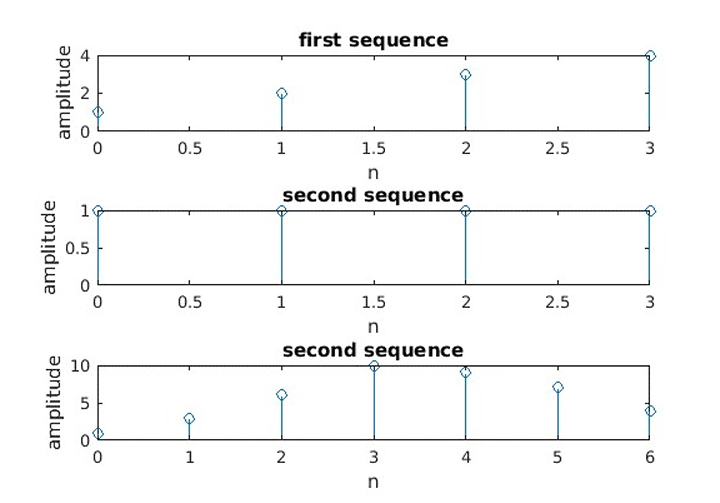
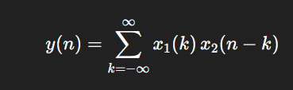

# 📘 Experiment: Linear Convolution

---

## 🧪 Aim

To write a program to understand and perform linear convolution of two discrete-time sequences using MATLAB.

---

## 💻 Apparatus

* MATLAB Software
* Personal Computer

---

## ⚙️ Procedure

1. Open MATLAB editor window.
2. Write the program for linear convolution.
3. Save the program with `.m` extension.
4. Run the program.
5. Enter the input sequences when prompted.
6. Observe the output in the figure window.
7. Verify the result and save the figure as `.bmp`.

---

## 🧾 MATLAB Program

```matlab
clc;
clear all;
close all;

x1 = input('enter the first sequence=');
n = 0:length(x1)-1;
subplot(3,1,1);
stem(n, x1);
xlabel('n');
ylabel('amplitude');
title('first sequence');

x2 = input('enter the second sequence=');
n = 0:length(x2)-1;
subplot(3,1,2);
stem(n, x2);
xlabel('n');
ylabel('amplitude');
title('second sequence');

y = conv(x1, x2);
n = 0:length(y)-1;

subplot(3,1,3);
stem(n, y);
xlabel('n');
ylabel('amplitude');
title('Linear Convolution');
```

---

## 🧾 Python Equivalent Program

```python
import numpy as np
import matplotlib.pyplot as plt

# Input sequences
x1 = list(map(float, input("Enter first sequence (space-separated): ").split()))
x2 = list(map(float, input("Enter second sequence (space-separated): ").split()))

x1 = np.array(x1)
x2 = np.array(x2)

# First sequence plot
n1 = np.arange(len(x1))
plt.subplot(3, 1, 1)
plt.stem(n1, x1)
plt.xlabel('n')
plt.ylabel('amplitude')
plt.title('First Sequence')

# Second sequence plot
n2 = np.arange(len(x2))
plt.subplot(3, 1, 2)
plt.stem(n2, x2)
plt.xlabel('n')
plt.ylabel('amplitude')
plt.title('Second Sequence')

# Linear convolution
y = np.convolve(x1, x2)
n3 = np.arange(len(y))

plt.subplot(3, 1, 3)
plt.stem(n3, y)
plt.xlabel('n')
plt.ylabel('amplitude')
plt.title('Linear Convolution')

plt.tight_layout()
plt.show()

# Save figure
plt.savefig("linear_convolution.bmp")

print("Convolution Output:", y)
```

---

## 📊 Output



* First subplot → First input sequence
* Second subplot → Second input sequence
* Third subplot → Result of linear convolution

---

## 🧠 Concept

* **Linear Convolution** is used to determine the output of a system when an input signal passes through it.
* It is mathematically defined as:



* Length of output:

  

---

## 🔍 Applications

* Signal filtering
* System response analysis
* Audio processing
* Communication systems

---

## ⚠️ Notes

* Input sequences must be numeric.
* Output length will always be greater than input sequences.
* Ensure correct indexing while plotting.

---

## ✅ Result

The linear convolution of two input sequences was successfully computed and verified using MATLAB.

---
