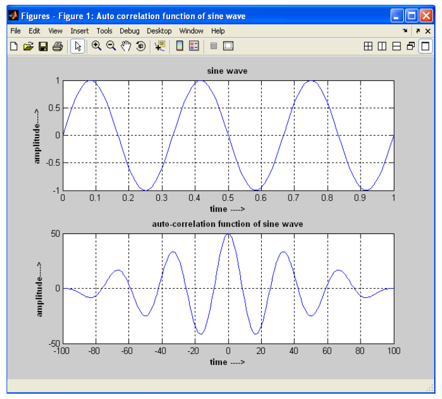
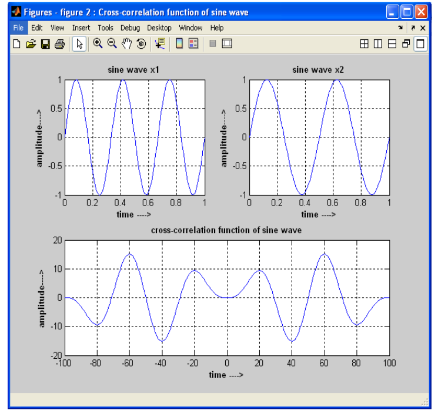
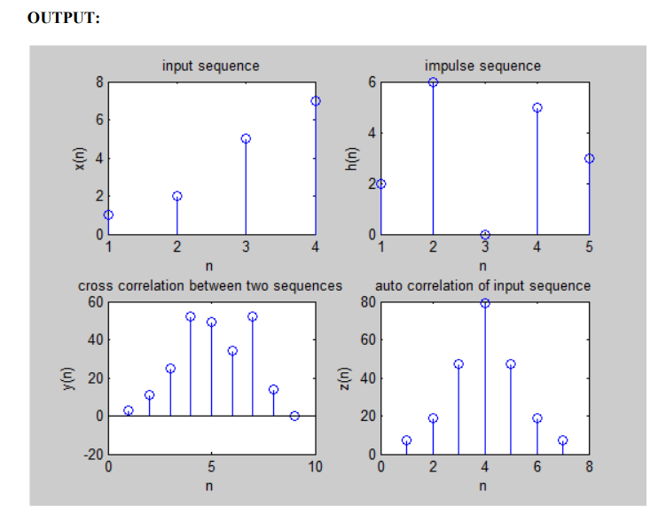

# 📡 Auto-Correlation and Cross-Correlation using MATLAB

## 📌 Overview

This project demonstrates the computation of **Auto-Correlation** and **Cross-Correlation** of discrete-time signals using MATLAB. These operations are essential in Digital Signal Processing (DSP) for analyzing signal similarity, detecting patterns, and identifying time shifts between signals.

---

## 🎯 Aim

To write a MATLAB program:

* To compute **Auto-Correlation** of a signal
* To compute **Cross-Correlation** between two signals
* To visualize correlation functions using plots

---

## 🛠️ Software Requirements

* MATLAB (Version 2019b or later)
* PC / Laptop

---

## ⚙️ Procedure

1. Open MATLAB
2. Create a new script file (M-file)
3. Enter the program code
4. Save the file in the working directory
5. Run the program
6. Observe outputs in:

   * Command Window
   * Figure Window (plots)

---

## 💻 Program Description

### 🔹 Auto-Correlation

* Measures similarity of a signal with itself over time shifts
* Computed using MATLAB function:

  ```matlab
  [rxx, lag] = xcorr(x1);
  ```

---

### 🔹 Cross-Correlation

* Measures similarity between two different signals
* Helps identify delay or alignment between signals
* Computed using:

  ```matlab
  [cxx, lag] = xcorr(x1, x2);
  ```

---

## 📊 Output

### Auto-Correlation:



* Displays how the sine wave correlates with itself
* Maximum value occurs at **zero lag**

### Cross-Correlation:



* Shows similarity between two sine waves of different frequencies
* Helps detect phase/time differences

---

## 📊 Output




---

## 📁 File Structure

```id="dj39dk"
DSP-Correlation/
│── auto_cross_correlation.m
│── README.md
```

---

## 📈 Key Concepts

* Signal similarity
* Time shifting (lag)
* Pattern detection
* Periodicity analysis

---

## 🚀 Applications

* Signal detection
* Speech recognition
* Radar and sonar systems
* Feature extraction in machine learning
* Time delay estimation

---

## 🔮 Future Enhancements

* Normalize correlation results
* Add noisy signal analysis
* Compare signals with phase shift
* Implement in Python (NumPy / SciPy)

---

## 👨‍💻 Author

**Kishor**
Engineering Student
GitHub: https://github.com/Kishor055

---

## ⭐ Support

If you find this helpful, consider giving the repository a ⭐!
