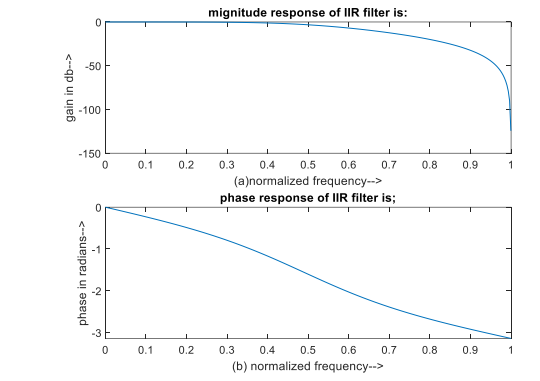
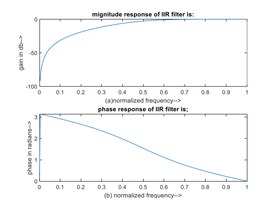

# 🎚️ Design of IIR Butterworth Low Pass / High Pass Filters (MATLAB)

## 📌 Overview

This project demonstrates the design of **IIR Butterworth Filters** (Low Pass and High Pass) using MATLAB. Butterworth filters are widely used due to their **maximally flat frequency response** in the passband.

---

## 🎯 Aim

To write a MATLAB program:

* To design **Butterworth IIR Low Pass Filter (LPF)**
* To design **Butterworth IIR High Pass Filter (HPF)**
* To plot **magnitude and phase response** of the filter

---

## 🛠️ Software Requirements

* MATLAB (Version 2019b or later)
* PC / Laptop

---

## ⚙️ Procedure

1. Open MATLAB
2. Create a new M-file
3. Enter the program code
4. Save in the working directory
5. Run the program
6. Observe:

   * Command Window (inputs & outputs)
   * Figure Window (frequency response plots)

---

## 📚 Theory

### 🔹 Butterworth Filter

* Has **flat frequency response** in passband
* No ripples in passband or stopband
* Smooth transition from passband to stopband

---

### 🔹 Filter Design Steps

1. Define specifications:

   * Passband ripple (rp)
   * Stopband attenuation (rs)
   * Passband frequency (wp)
   * Stopband frequency (ws)
   * Sampling frequency (fs)

2. Normalize frequencies

3. Compute filter order using:

   ```matlab
   [n, wn] = buttord(wp, ws, rp, rs);
   ```

4. Design filter using:

   ```matlab
   [b, a] = butter(n, wn, 'low/high');
   ```

---

## 💻 Program Description

The MATLAB program:

* Accepts filter specifications from user
* Calculates filter order and cutoff frequency
* Designs LPF or HPF based on user choice
* Computes frequency response using `freqz()`
* Plots:

  * Magnitude response (in dB)
  * Phase response (in radians)

---

## 📥 Input

```text id="iirinput1"
Passband ripple (rp): 2  
Stopband ripple (rs): 20  
Passband frequency (wp): 1000 Hz  
Stopband frequency (ws): 2000 Hz  
Sampling frequency (fs): 5000 Hz  
Choice: 1 (LPF) or 2 (HPF)
```

---

## 📊 Output





* Filter coefficients (b, a)
* Magnitude response plot
* Phase response plot

---

## 📁 File Structure

```id="l92kd0"
DSP-IIR-Butterworth/
│── iir_butterworth.m
│── README.md
```

---

## 📈 Key Concepts

* IIR filter design
* Frequency normalization
* Magnitude and phase response
* Filter order estimation

---

## 🚀 Applications

* Audio signal filtering
* Noise removal
* Communication systems
* Biomedical signal processing
* Control systems

---

## 🔮 Future Enhancements

* Add Bandpass and Bandstop filters
* Compare Butterworth with Chebyshev filters
* GUI-based filter design tool
* Real-time signal filtering

---

## 👨‍💻 Author

**Kishor**
Engineering Student
GitHub: https://github.com/Kishor055

---

## ⭐ Support

If you find this useful, consider giving the repository a ⭐!
