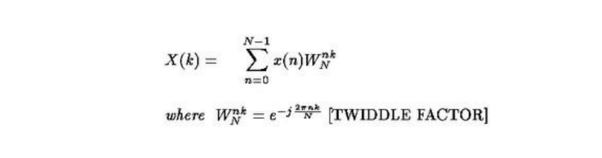
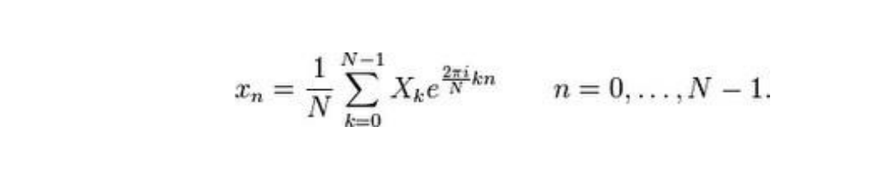
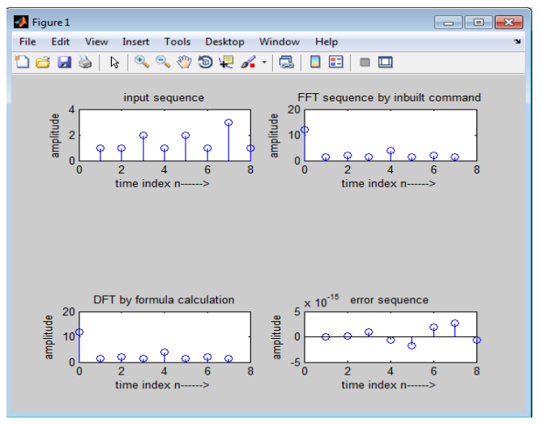

# 📡 Discrete Fourier Transform (DFT) using MATLAB

## 📌 Overview

This project demonstrates the implementation of the **Discrete Fourier Transform (DFT)** and **Inverse Discrete Fourier Transform (IDFT)** using MATLAB. It also includes computation of the **Power Density Spectrum** of a given discrete-time sequence.

---

## 🎯 Aim

To write a MATLAB program:

* To compute the **DFT** of a given sequence
* To compute the **IDFT**
* To analyze the **frequency-domain representation**
* To evaluate the **power spectral density**

---

## 🛠️ Software Requirements

* MATLAB (Version 2019b or later)
* PC / Laptop

---

## ⚙️ Procedure

1. Open MATLAB
2. Create a new script file (M-file)
3. Enter the program code
4. Save the file in the working directory
5. Run the program
6. Observe output in:

   * Command Window
   * Figure Window (if plots are added)

---

## 📚 Theory

### 🔹 Discrete Fourier Transform (DFT)

The DFT converts a discrete-time signal from the **time domain** to the **frequency domain**:



---

### 🔹 Inverse Discrete Fourier Transform (IDFT)



---

## 💻 Program Description

The MATLAB program:

* Accepts an input sequence
* Computes its DFT using built-in/manual methods
* Computes IDFT to reconstruct the original signal
* Displays complex frequency components
* Optionally computes power spectrum

---

## 📥 Input

```text
[1 1 2 1 2 1 3 1]
```

---

## 📤 Output

### DFT Result:

```text id="dftout1"
12.0000  -1.0000+1.0000i  -2.0000  -1.0000-1.0000i  
4.0000   -1.0000+1.0000i  -2.0000  -1.0000-1.0000i
```

### IDFT Result (Reconstructed Signal):

```text id="dftout2"
12.0000  -1.0000+1.0000i  -2.0000  -0.0000i  
-1.0000-1.0000i  4.0000+0.0000i  -1.0000+1.0000i  
-2.0000-0.0000i  -1.0000-1.0000i
```

### Numerical Error (Approximation):

```text id="dftout3"
~ 1.0e-14 (very small values close to zero)
```

---

## 📊 Observations



* DFT converts time-domain signal into frequency components
* IDFT reconstructs the original signal (with negligible error)
* Small imaginary/decimal values occur due to **floating-point precision**
* Power spectrum helps identify dominant frequencies

---

## 📁 File Structure

```id="f83kd9"
DSP-DFT/
│── dft_program.m
│── README.md
```

---

## 📈 Key Concepts

* Time-domain to frequency-domain conversion
* Complex numbers in signal processing
* Spectral analysis
* Numerical approximation errors

---

## 🚀 Applications

* Signal analysis
* Audio and speech processing
* Image compression (JPEG)
* Communication systems
* Radar and biomedical signal processing

---

## 🔮 Future Enhancements

* Implement **FFT (Fast Fourier Transform)** for faster computation
* Plot magnitude and phase spectrum
* Compare DFT vs FFT performance
* Real-time signal analysis

---

## 👨‍💻 Author

**Kishor**
Engineering Student
GitHub: https://github.com/Kishor055

---

## ⭐ Support

If you find this project useful, consider giving it a ⭐ on GitHub!


