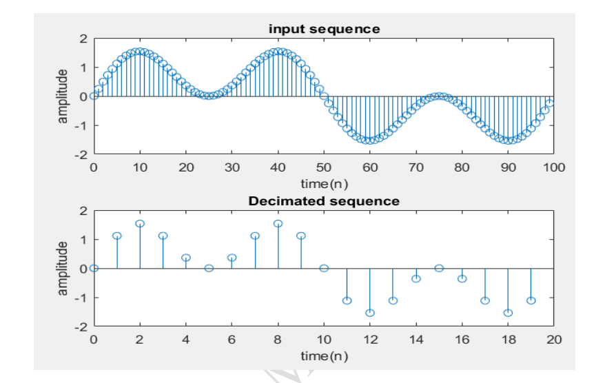

# 📘 Decimation Process using MATLAB

## 🎯 Aim

To implement and verify the **decimation (downsampling)** process of a given discrete-time signal using MATLAB.

---

## 🛠️ Software Used

* MATLAB

---

## 📖 Theory

**Decimation** is the process of reducing the sampling rate of a signal. It is commonly used in Digital Signal Processing (DSP) systems to lower computational complexity and memory usage.

* **Downsampling**: Refers to selecting every *D-th* sample and discarding the rest.
* **Decimation**: Combines **low-pass filtering + downsampling** to avoid aliasing.

(image.png)

**“Decimation”** is the process of reducing the sampling rate.
**“Downsampling”** is a more specific term which refers to just the process of throwing
away samples, without the lowpass filtering operation.
The most immediate reason to decimate is simply to reduce the sampling rate at
the output of one system so a system operating at a lower sampling rate can input the
signal. But a much more common motivation for decimation is to reduce the cost of
processing: the calculation and/or memory required to implement a DSP system generally
is proportional to the sampling rate, so the use of a lower sampling rate usually results in
a cheaper implementation.

---

### 💡 Why Decimation?

* Reduces processing cost
* Saves memory
* Enables compatibility between systems operating at different sampling rates

---

## 🧠 Algorithm

1. Define:

   * Downsampling factor (**D**)
   * Signal length (**L**)
   * Frequencies (**f₁, f₂**)

2. Generate input signal:

   * Combination of two sinusoidal signals

3. Apply decimation:

   * Use MATLAB function `decimate()`

4. Plot:

   * Input signal
   * Decimated output signal

---

## 🔄 Flow of Process

```
Start
  ↓
Input D, L, f1, f2
  ↓
Generate signal x(n)
  ↓
Apply decimation (y = decimate(x, D))
  ↓
Plot input & output signals
  ↓
End
```

---

## 💻 MATLAB Program

```matlab
clc;
clear all;
close all;

D = input('Enter the downsampling factor: ');
L = input('Enter the length of the input signal: ');
f1 = input('Enter the frequency of first sinusoidal: ');
f2 = input('Enter the frequency of second sinusoidal: ');

n = 0:L-1;
x = sin(2*pi*f1*n) + sin(2*pi*f2*n);

y = decimate(x, D, 'fir');

subplot(2,1,1);
stem(n, x(1:L));
title('Input Sequence');
xlabel('Time (n)');
ylabel('Amplitude');

subplot(2,1,2);
m = 0:(L/D)-1;
stem(m, y(1:L/D));
title('Decimated Sequence');
xlabel('Time (n)');
ylabel('Amplitude');
```

---

## 📥 Sample Input

* Downsampling factor (**D**) = 5
* Signal length (**L**) = 100
* Frequency (**f₁**) = 0.01
* Frequency (**f₂**) = 0.03

---

## 📊 Output

* The **input signal** shows a combination of two sine waves.
* The **decimated signal** contains fewer samples (1/D of original).
* A low-pass filter ensures minimal aliasing before downsampling.

---



---

## ✅ Result

The decimation process was successfully implemented and verified using MATLAB. The output confirms that the sampling rate is reduced by the given factor while preserving the essential characteristics of the signal.

---

## ⚠️ Notes

* Always use filtering before downsampling to avoid aliasing.
* The `decimate()` function internally applies a low-pass filter.
* Ensure that the signal length is divisible by the downsampling factor for proper visualization.

---

## 📌 Applications

* Audio signal processing
* Image compression
* Communication systems
* Multirate DSP systems

---

## 👨‍💻 Author

DSP Lab Experiment – ECE Department

---
