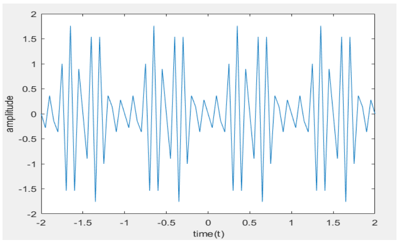

# 📘 Generation of DTMF Signals using MATLAB

## 🎯 Aim

To generate **DTMF (Dual Tone Multi Frequency) signals** using MATLAB.

---

## 🛠️ Software Used

* MATLAB

---

## 📖 Theory

**DTMF (Dual Tone Multi Frequency)** is a signaling method used in telecommunication systems to represent digits using a combination of two distinct frequencies.

Each DTMF signal:

* Is a **sum of two sinusoidal signals**
* Contains:

  * One frequency from the **low-frequency group**
  * One frequency from the **high-frequency group**

### 📊 Frequency Groups

| Low Frequencies (Hz) | High Frequencies (Hz) |
| -------------------- | --------------------- |
| 697                  | 1209                  |
| 770                  | 1336                  |
| 852                  | 1477                  |
| 941                  | 1633                  |

Each key on a keypad corresponds to a **unique pair** of these frequencies.

---

## 💡 Applications

* Telephone dialing systems
* Interactive Voice Response (IVR)
* ATM and banking systems
* Remote control systems

---

## 🧠 Algorithm

1. Define time vector `t`
2. Input the desired digit
3. Define standard DTMF frequencies
4. Generate signals using sine waves:

   * Combine one low-frequency and one high-frequency tone
5. Use conditional statements to select appropriate signal
6. Plot the generated DTMF signal

---

## 🔄 Flow of Process

```id="flow01"
Start
  ↓
Input digit
  ↓
Assign frequency pair
  ↓
Generate DTMF signal
  ↓
Plot signal
  ↓
End
```

---

## 💻 MATLAB Program

```matlab id="dtmf01"
clc;
clear all;
close all;

t = -2:0.05:2;
x = input('Enter the input number: ');

fr1 = 697; fr2 = 770; fr3 = 852; fr4 = 941;
fc1 = 1209; fc2 = 1336; fc3 = 1477; fc4 = 1633;

y0 = sin(2*pi*fr4*t) + sin(2*pi*fc2*t); % 0
y1 = sin(2*pi*fr1*t) + sin(2*pi*fc1*t); % 1
y2 = sin(2*pi*fr1*t) + sin(2*pi*fc2*t); % 2
y3 = sin(2*pi*fr1*t) + sin(2*pi*fc3*t); % 3
y4 = sin(2*pi*fr2*t) + sin(2*pi*fc1*t); % 4
y5 = sin(2*pi*fr2*t) + sin(2*pi*fc2*t); % 5
y6 = sin(2*pi*fr2*t) + sin(2*pi*fc3*t); % 6
y7 = sin(2*pi*fr3*t) + sin(2*pi*fc1*t); % 7
y8 = sin(2*pi*fr3*t) + sin(2*pi*fc2*t); % 8
y9 = sin(2*pi*fr3*t) + sin(2*pi*fc3*t); % 9
y_start = sin(2*pi*fr4*t) + sin(2*pi*fc1*t); % *
y_canc  = sin(2*pi*fr4*t) + sin(2*pi*fc3*t); % #

if (x==1)
    plot(t,y1)
elseif (x==2)
    plot(t,y2)
elseif (x==3)
    plot(t,y3)
elseif (x==4)
    plot(t,y4)
elseif (x==5)
    plot(t,y5)
elseif (x==6)
    plot(t,y6)
elseif (x==7)
    plot(t,y7)
elseif (x==8)
    plot(t,y8)
elseif (x==9)
    plot(t,y9)
elseif (x==0)
    plot(t,y0)
elseif (x==11)
    plot(t,y_start)
elseif (x==12)
    plot(t,y_canc)
else
    disp('Enter the correct input')
end

xlabel('Time (t)');
ylabel('Amplitude');
title('DTMF Signal');
```

---

## 📥 Sample Input

* Enter the input number = **7**

---

## 📊 Output

* The generated waveform represents the DTMF tone for digit **7**
* It is a combination of:

  * **852 Hz (low frequency)**
  * **1209 Hz (high frequency)**

---

## ✅ Result



DTMF signals were successfully generated using MATLAB by combining two sinusoidal signals corresponding to the selected input digit.

---

## ⚠️ Notes

* Each digit has a **unique frequency pair**
* Proper frequency selection avoids **signal interference**
* Ensure correct input values:

  * `0–9` → digits
  * `11` → `*`
  * `12` → `#`

---

## 📌 Conclusion

The experiment demonstrates how DTMF signals are generated using frequency combinations, which form the backbone of modern telecommunication signaling systems.

---

## 👨‍💻 Author

DSP Lab Experiment – ECE Department

---
