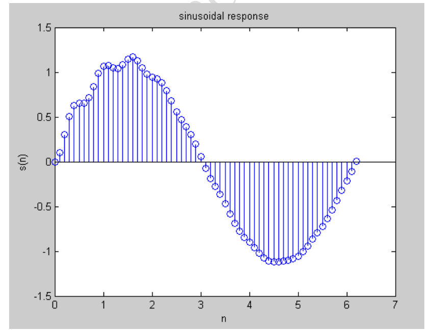

# 📘 Generation of Sinusoidal Signal Through Filtering (MATLAB)

## 🎯 Aim

To generate a **sinusoidal signal through filtering** using MATLAB.

---

## 🛠️ Software Used

* MATLAB

---

## 📖 Theory

A **digital filter** is a system that selectively allows certain frequency components of a signal to pass while attenuating others.

* An **LTI (Linear Time-Invariant) system** can modify the frequency content of an input signal.
* Any discrete-time signal can be expressed as a sum of **sinusoidal components** using the **Inverse Discrete Fourier Transform (IDFT)**.
* By designing the filter appropriately, we can:

  * Pass desired frequency components
  * Suppress unwanted frequencies

### 💡 Key Concept

Filtering works based on:

* **Frequency selectivity**
* **System response defined by difference equation**

In this experiment:

* A recursive filter is used
* The filter shapes the output into a sinusoidal-like response

---

## 🧠 Algorithm

1. Define filter coefficients:

   * Numerator (**b**)
   * Denominator (**a**)

2. Define input signal:

   * Generate sinusoidal input using `sin()` function

3. Apply filter:

   * Use MATLAB `filter()` function

4. Plot output signal

---

## 🔄 Flow of Process

```id="flow02"
Start
  ↓
Define filter coefficients (b, a)
  ↓
Generate input signal x(n)
  ↓
Apply filter using filter()
  ↓
Plot output signal
  ↓
End
```

---

## 💻 MATLAB Program

```matlab id="sinfilter01"
close all;
clear all;
clc;

b = [1];
a = [1, -1, 0.9];

n = -20:120;
t = 0:0.1:2*pi;

x = sin(t);

s = filter(b, a, x);

stem(t, s);

title('Sinusoidal Response');
xlabel('n');
ylabel('s(n)');
```

---

## 📊 Explanation of Code

* `b = [1]` → Numerator coefficients
* `a = [1, -1, 0.9]` → Denominator coefficients (defines filter behavior)
* `x = sin(t)` → Input sinusoidal signal
* `filter(b, a, x)` → Applies digital filtering
* `stem()` → Displays discrete-time output

---

## 📥 Sample Input

* No user input required
* Signal generated internally using sine function

---

## 📊 Output

* The output is a **filtered sinusoidal signal**
* Shape depends on filter coefficients
* Demonstrates how filtering modifies signal characteristics

---

## ✅ Result

The sinusoidal signal was successfully generated and modified using a digital filter in MATLAB.



---

## ⚠️ Notes

* The filter used is a **recursive (IIR) filter**
* Output depends heavily on coefficients of `a` and `b`
* Ensure stability of the system:

  * Poles should lie inside the unit circle

---

## 📌 Applications

* Signal processing systems
* Noise filtering
* Audio signal enhancement
* Communication systems

---

## 📚 Conclusion

This experiment demonstrates how filtering can be used to generate and modify sinusoidal signals by controlling frequency components using an LTI system.

---

## 👨‍💻 Author

DSP Lab Experiment – ECE Department

---
