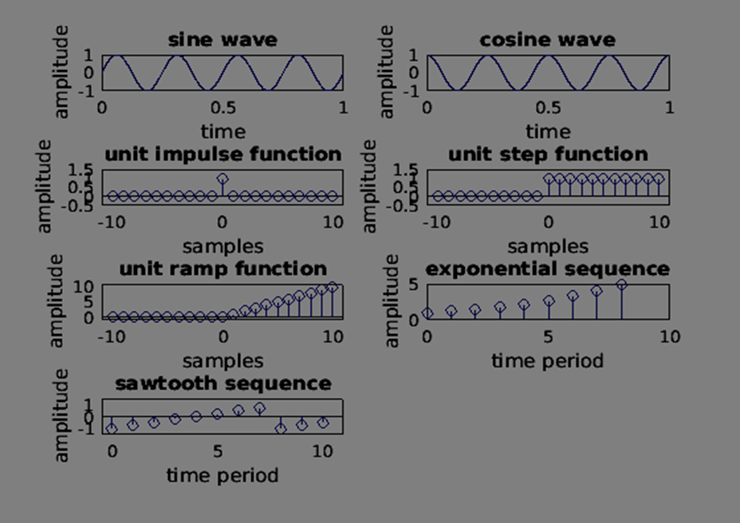

# 📘 Digital Signal Processing Lab

## Experiment 01: Generation of Standard Test Signals and Basic Signals

---

## 🧪 Aim

To develop a MATLAB program that generates and visualizes standard test signals and basic signals used in digital signal processing. This experiment helps in understanding the mathematical representation and graphical behavior of fundamental signals.

---

## 💻 Software Requirements

* MATLAB (recommended: R2018 or later)
* Personal Computer with minimum 4GB RAM
* Basic knowledge of MATLAB scripting

---

## 📖 Description

In digital signal processing, basic signals are essential building blocks used to model, analyze, and design systems. This experiment focuses on generating both continuous-time and discrete-time signals using MATLAB.

The program demonstrates how different signals behave over time and how they are represented graphically. It also highlights the importance of sampling frequency and time indexing in signal processing.

### Signals Generated:

* **Sine Wave:** Represents periodic oscillations commonly used in communication systems.
* **Cosine Wave:** Similar to sine but phase-shifted; widely used in modulation techniques.
* **Unit Impulse Signal:** Represents an instantaneous signal at a specific point in time.
* **Unit Step Signal:** Models signals that turn on at a particular instant.
* **Unit Ramp Signal:** Represents a linearly increasing signal.
* **Exponential Signal:** Used to model growth and decay processes in systems.
* **Sawtooth Signal:** A non-sinusoidal waveform useful in signal testing and synthesis.

---

## ⚙️ Procedure

1. Launch MATLAB environment.
2. Create a new script file (.m file).
3. Enter the MATLAB code for signal generation.
4. Save the file with an appropriate name.
5. Execute the script.
6. Provide input values when prompted (for exponential signal).
7. Observe the generated plots in the figure window.

---

## 🧾 Program Explanation

* **Sampling Setup:**
  The sampling frequency (`fs`) and time step (`ts`) define how finely the signal is represented.

* **Continuous Signals:**
  Sine and cosine waves are generated using trigonometric functions.

* **Discrete Signals:**
  Impulse, step, and ramp signals are created using logical operations on discrete indices.

* **User Input Handling:**
  The exponential signal allows dynamic input for length and growth/decay factor.

* **Visualization:**
  MATLAB’s `subplot()` function is used to display multiple signals in a single figure for better comparison.

  * `plot()` is used for continuous signals
  * `stem()` is used for discrete signals

---

## 📊 Output

The program produces a figure window containing multiple subplots, each representing a different signal.

### Output Features:

* Clearly labeled axes (Time/Samples vs Amplitude)
* Proper titles for each signal
* Organized layout for easy comparison
* Visualization of both continuous and discrete signals

---

## 🧠 Key Concepts Covered

* Signal Classification (Continuous vs Discrete)
* Time Representation of Signals
* MATLAB Signal Generation Functions
* Data Visualization Techniques
* Importance of Sampling Frequency
* Practical understanding of signal behavior

---

## 🔍 Applications

* Communication Systems (modulation and demodulation)
* Signal Analysis and Processing
* Control Systems
* Audio and Speech Processing
* Testing and Simulation of DSP algorithms

---

## ⚠️ Notes

* Ensure the Signal Processing Toolbox is installed for using the `sawtooth()` function.
* Incorrect input values for exponential signals may lead to very large or very small outputs.
* Adjust sampling frequency for smoother waveforms if needed.

---

## ✅ Result

The MATLAB program was successfully implemented, and all standard test signals along with basic signals were generated and visualized accurately.

---

## 📎 Author

**Student Name:** Kishor Vitthal Kakde
