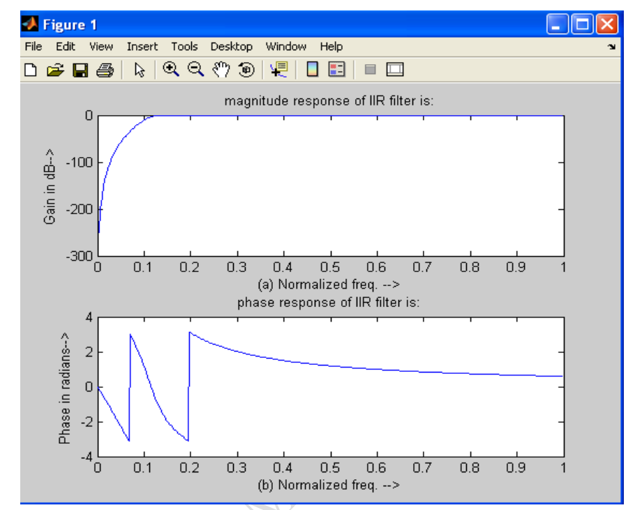

# 📘 Implementation of High Pass IIR Filter using MATLAB

## 🎯 Aim

To implement a **High Pass IIR (Infinite Impulse Response) Filter** for a given sequence using MATLAB.

---

## 🛠️ Software Used

* MATLAB

---

## 📖 Theory

An **IIR filter** is a digital filter whose output depends on:

* present input
* past input values
* previous output values

A **High Pass Filter (HPF)** allows **high-frequency components** to pass and attenuates **low-frequency components**.

In this experiment, a **Butterworth High Pass IIR filter** is designed.

### 💡 Why Butterworth Filter?

* Maximally flat magnitude response
* Smooth passband
* No ripple in passband

---

## 🧠 Algorithm

1. Enter:

   * Passband ripple (**rp**)
   * Stopband ripple (**rs**)
   * Passband frequency (**wp**)
   * Stopband frequency (**ws**)
   * Sampling frequency (**fs**)

2. Normalize frequencies:

   w_1 = \frac{2w_p}{f_s}, \quad w_2 = \frac{2w_s}{f_s}

3. Determine filter order using Butterworth design:

   [n, w_n] = \text{buttord}(w_1, w_2, r_p, r_s)

4. Design high pass filter:

   [b,a] = \text{butter}(n,w_n,\text{high})

5. Compute frequency response using `freqs()`

6. Plot:

   * Magnitude response
   * Phase response

---

## 🔄 Flow Chart

```id="flow03"
Start
  ↓
Input rp, rs, wp, ws, fs
  ↓
Normalize frequencies
  ↓
Find filter order
  ↓
Design Butterworth HPF
  ↓
Calculate frequency response
  ↓
Plot magnitude & phase response
  ↓
End
```

---

## 💻 MATLAB Program

```matlab id="iirhpf01"
clc;
clear all;
close all;

disp('Enter the IIR filter design specifications');

rp = input('Enter the passband ripple: ');
rs = input('Enter the stopband ripple: ');
wp = input('Enter the passband frequency: ');
ws = input('Enter the stopband frequency: ');
fs = input('Enter the sampling frequency: ');

w1 = 2 * wp / fs;
w2 = 2 * ws / fs;

[n, wn] = buttord(w1, w2, rp, rs, 's');

disp('Frequency response of IIR HPF is:');

[b, a] = butter(n, wn, 'high', 's');

w = 0:0.01:pi;

[h, om] = freqs(b, a, w);

m = 20 * log10(abs(h));
an = angle(h);

figure;

subplot(2,1,1);
plot(om/pi, m);
title('Magnitude Response of IIR HPF');
xlabel('Normalized Frequency');
ylabel('Gain in dB');

subplot(2,1,2);
plot(om/pi, an);
title('Phase Response of IIR HPF');
xlabel('Normalized Frequency');
ylabel('Phase in Radians');
```

---

## 📥 Sample Input

* Passband ripple = **15 dB**
* Stopband ripple = **60 dB**
* Passband frequency = **1500 Hz**
* Stopband frequency = **3000 Hz**
* Sampling frequency = **7000 Hz**

---

## INPUT:
* enter the IIR filter design specifications
* enter the passband ripple15
* enter the stopband ripple60
* enter the passband freq1500
* enter the stopband freq3000
* enter the sampling freq7000

## 📊 Output



### 1️⃣ Magnitude Response

* Low frequencies are attenuated
* High frequencies are passed

### 2️⃣ Phase Response

* Displays phase shift introduced by filter

---

## ✅ Result

The **High Pass IIR Butterworth filter** was successfully designed and implemented using MATLAB, and its magnitude and phase responses were plotted.

---

## ⚠️ Notes

* High pass filters remove low-frequency noise
* `buttord()` finds minimum filter order
* `butter()` designs the filter
* `freqs()` gives analog frequency response

---

## 📌 Applications

* Audio noise removal
* Signal conditioning
* Communication systems
* Biomedical signal processing

---

## 📚 Conclusion

This experiment demonstrates the design and implementation of a Butterworth High Pass IIR filter, useful for preserving high-frequency components while rejecting lower frequencies.

---

## 👨‍💻 Author

DSP Lab Experiment – ECE Department

---
