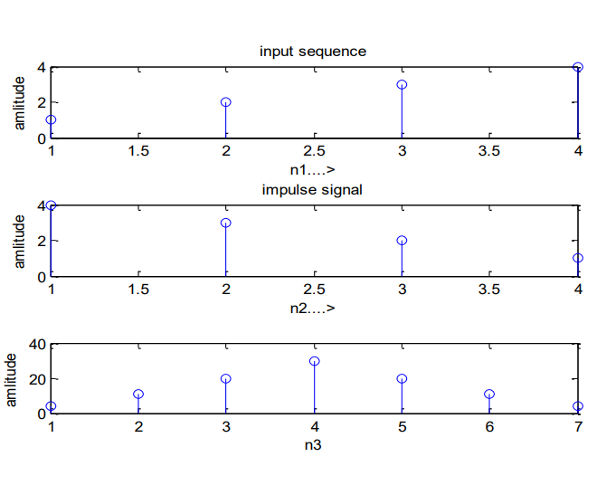
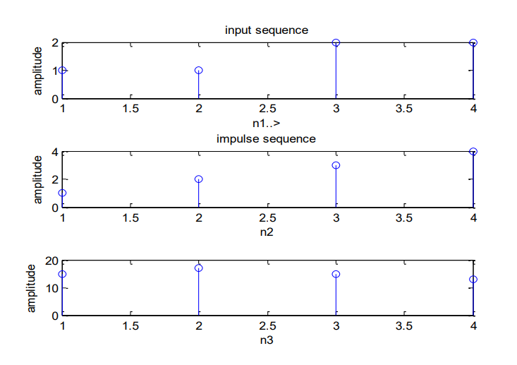

# 📡 Linear and Circular Convolution using MATLAB

## 📌 Overview

This project demonstrates the implementation of **Linear Convolution** and **Circular Convolution** of discrete-time signals using MATLAB. Convolution is a fundamental operation in Digital Signal Processing (DSP) used to determine the output of a system given an input and its impulse response.

---

## 🎯 Aim

To write MATLAB programs:

* To compute **Linear Convolution** of two sequences
* To compute **Circular Convolution** of two sequences
* To visualize the input, impulse response, and output signals

---

## 🛠️ Software Requirements

* MATLAB (Version 2019b or later)
* PC / Laptop

---

## ⚙️ Procedure

1. Open MATLAB
2. Create a new script file (M-file)
3. Enter the program code
4. Save the file in the working directory
5. Run the program
6. Observe the output in:

   * Command Window
   * Figure Window (plots)

---

## 💻 Program Description

### 🔹 Linear Convolution

* Performed using MATLAB’s built-in `conv()` function

* Output length:
  **N = n₁ + n₂ − 1**

* Steps:

  * Input two sequences
  * Apply convolution operation
  * Plot input, impulse, and output signals

---

### 🔹 Circular Convolution

* Used for periodic signals
* Typically computed using:

  * Manual method OR
  * FFT-based method:

    ```matlab
    y = ifft(fft(x).*fft(h));
    ```

---

## 📊 Output



### Example:

* Input Sequence: [1 2 3 4]
* Impulse Sequence: [4 3 2 1]

**Linear Convolution Result:**

```id="k29d8s"
[4 11 20 30 20 11 4]
```

* The output signal length is greater than the input signals
* Shows how signals overlap and accumulate over time

---

## 🔄 Circular Convolution – Output

### 📥 Input

* Input Sequence:

  ```text
  [1 2 2 1]
  ```
* Impulse Sequence:

  ```text
  [4 3 2 1]
  ```

---

### 📤 Output



**Circular Convolution Result:**

```text
[15 17 15 13]
```

---

## 📊 Explanation

* Circular convolution assumes both sequences are **periodic**
* Output length is equal to the length of the input sequences (N-point convolution)
* Unlike linear convolution, the signal **wraps around (modulo operation)**

---

## 📈 Key Observation

* Linear Convolution result is longer (N1 + N2 − 1)
* Circular Convolution result has fixed length (N)
* Circular convolution is widely used in:

  * Fast computation using FFT
  * Digital communication systems
  * Real-time signal processing

---


## 📁 File Structure

```id="d82ksl"
DSP-Convolution/
│── linear_convolution.m
│── circular_convolution.m
│── README.md
```

---

## 📈 Key Concepts

* Convolution operation in DSP
* Linear vs Circular convolution
* Signal overlap and accumulation
* Time-domain signal processing

---

## 🚀 Applications

* Digital filtering
* Signal analysis
* Image processing
* Communication systems
* Audio processing

---

## 🔮 Future Enhancements

* Add graphical comparison of linear vs circular convolution
* Implement circular convolution manually (without FFT)
* Extend to 2D convolution (image processing)
* Python implementation using NumPy

---

## 👨‍💻 Author

**Kishor**
Engineering Student
GitHub: https://github.com/Kishor055

---

## ⭐ Support

If you find this helpful, consider giving the repository a ⭐ on GitHub!
