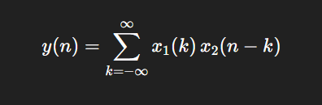
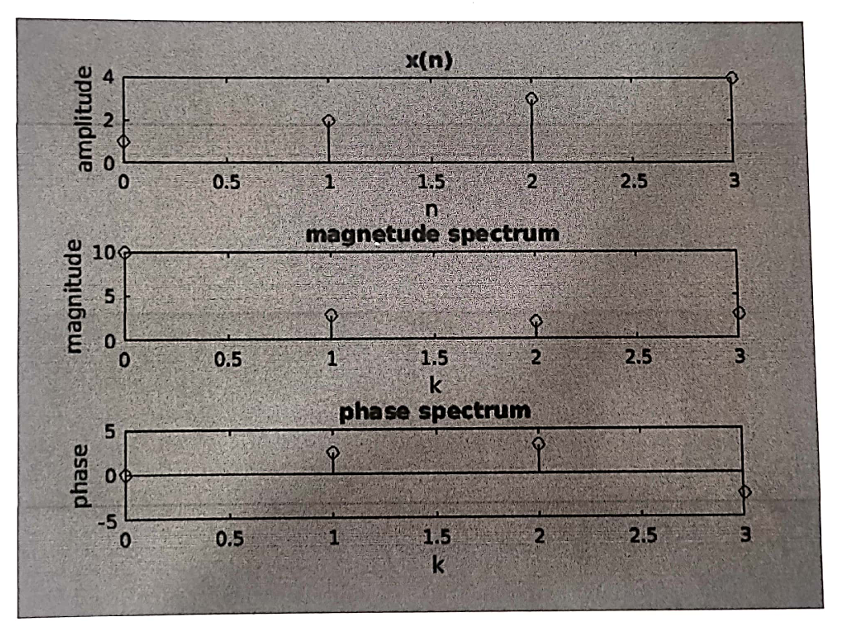

# 📘 Experiment: Linear Convolution of Two Sequences

---

## 🧪 Aim

To write a MATLAB program to perform linear convolution of two discrete-time sequences and visualize the result.

---

## 💻 Apparatus

* MATLAB Software
* Personal Computer

---

## ⚙️ Procedure

1. Open the MATLAB editor window.
2. Write the program for linear convolution.
3. Save the file with `.m` extension.
4. Run the program.
5. Enter the input sequences when prompted.
6. Observe the output in the figure window.
7. Verify the convolution result.
8. Save the output graph as a `.bmp` file.

---

## 🧾 Program

```matlab
clc;
clear all;
close all;

x1 = input('enter the first sequence=');
n = 0:length(x1)-1;
subplot(3,1,1);
stem(n,x1);
xlabel('n');
ylabel('amplitude');
title('first sequence');

x2 = input('enter the second sequence=');
n = 0:length(x2)-1;
subplot(3,1,2);
stem(n,x2);
xlabel('n');
ylabel('amplitude');
title('second sequence');

y = conv(x1,x2);
n = 0:length(y)-1;

subplot(3,1,3);
stem(n,y);
xlabel('n');
ylabel('amplitude');
title('Linear Convolution');
```

---

## 📊 Output

The figure window displays:

* First subplot → First input sequence
* Second subplot → Second input sequence
* Third subplot → Linear convolution result

---

## 🧠 Theory

Linear convolution is a mathematical operation used to determine the output of a Linear Time-Invariant (LTI) system for a given input.

It is defined as:



Where:

* (x_1(n)) = Input signal
* (x_2(n)) = Impulse response
* (y(n)) = Output signal

### Important Property:


---

## 🔍 Applications

* Digital signal filtering
* Image processing
* Audio signal processing
* Communication systems
* System response analysis

---

## ⚠️ Notes

* Input sequences must be numeric values.
* The output length depends on both input sequences.
* Ensure correct indexing while plotting graphs.

---

## ✅ Result



The linear convolution of two discrete-time sequences was successfully computed and visualized using MATLAB.

---

## 📎 Author

**Student Name:** Kishor Vitthal Kakde
