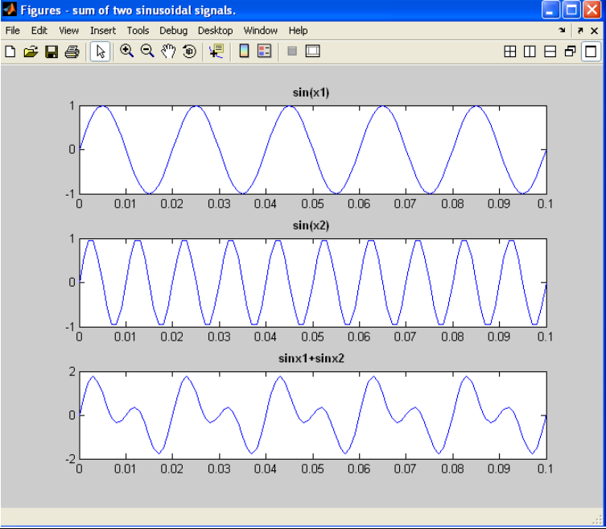

# 📡 Sum of Two Sinusoidal Signals & Frequency Response (MATLAB)

## 📌 Overview

This project demonstrates the generation and summation of two sinusoidal signals using MATLAB. It also introduces the concept of analyzing signals through their frequency characteristics such as magnitude and phase.

---

## 🎯 Aim

To write a MATLAB program:

* To generate two sinusoidal signals
* To compute their sum
* To visualize the resulting waveform
* To understand frequency response (magnitude and phase)

---

## 🛠️ Software Requirements

* MATLAB (Version 2019b or later)
* PC / Laptop

---

## ⚙️ Procedure

1. Open MATLAB
2. Create a new script file (M-file)
3. Enter the program code
4. Save the file in the working directory
5. Run the program
6. Observe results in:

   * Command Window
   * Figure Window (plots)

---

## 💻 Program Description

The MATLAB program performs the following steps:

### 1. Generate Time Vector

* Time range defined from 0 to 0.1 seconds with small intervals

### 2. First Sinusoidal Signal

* Frequency: 50 Hz
* Signal: sin(2πf₁t)

### 3. Second Sinusoidal Signal

* Frequency: 100 Hz
* Signal: sin(2πf₂t)

### 4. Signal Addition

* The resulting signal is the sum of both sinusoidal signals:

  y(t) = y₁(t) + y₂(t)

### 5. Visualization

* Three subplots are used:

  * First signal
  * Second signal
  * Resultant summed signal

---

## 📊 Output



* The first plot shows a 50 Hz sine wave
* The second plot shows a 100 Hz sine wave
* The third plot shows the combined waveform
* The resulting signal demonstrates **superposition of signals**

---

## 📁 File Structure

```id="h29dk2"
DSP-Sinusoidal-Sum/
│── sum_of_sinusoids.m
│── README.md
```

---

## 📈 Key Concepts

* Superposition of signals
* Sinusoidal signal generation
* Time-domain analysis
* Introduction to frequency components

---

## 🚀 Applications

* Communication systems (signal mixing)
* Audio signal processing
* Signal modulation techniques
* Fourier analysis basics

---

## 🔮 Future Enhancements

* Add FFT to compute magnitude and phase spectrum
* Visualize frequency response using `fft()`
* Extend to amplitude and phase variation
* Convert to interactive GUI

---

## 👨‍💻 Author

**Kishor**
Engineering Student
GitHub: https://github.com/Kishor055

---

## ⭐ Support

If you found this useful, consider giving the repository a ⭐!
