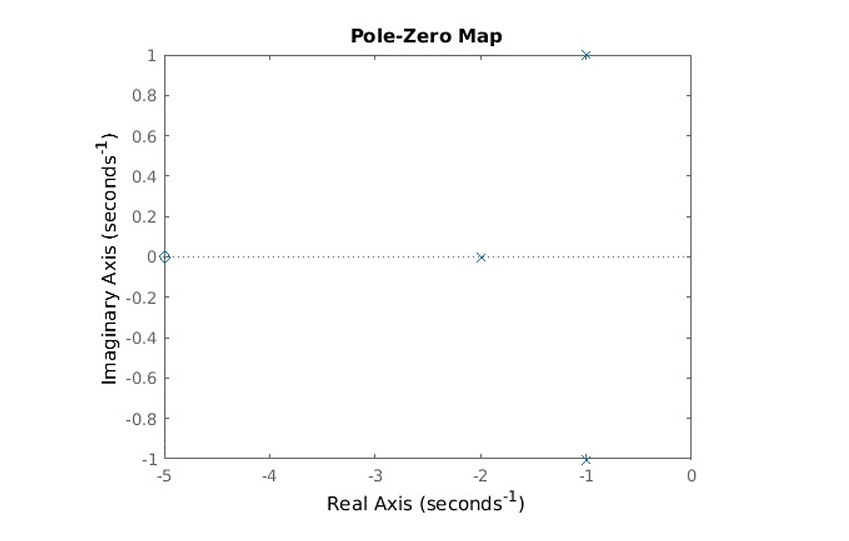

# 📘 Experiment: Pole-Zero Plot of a System

---

## ⚙️ Procedure

1. Open MATLAB / Python environment.
2. Create a new script file.
3. Enter the program code.
4. Run the program.
5. Enter the numerator and denominator coefficients as required.
6. Observe the Pole-Zero plot in the figure window.
7. Verify the poles and zeros.
8. Save the figure as a `.bmp` file.

---

## 🧾 MATLAB Program

```matlab
clc;
clear all;
close all;

p1 = input('enter the numerator matrix: ');
q1 = input('enter the denominator matrix: ');

sys = tf(p1, q1);
pzmap(sys);
grid on;
```

---

## 🧾 Python Equivalent Program

```python
import numpy as np
import matplotlib.pyplot as plt
from scipy import signal

# Input numerator and denominator
num = list(map(float, input("Enter numerator coefficients (space-separated): ").split()))
den = list(map(float, input("Enter denominator coefficients (space-separated): ").split()))

# Create system
system = signal.TransferFunction(num, den)

# Get zeros and poles
zeros, poles = signal.tf2zpk(num, den)

# Plot
plt.figure()

# Plot zeros (o)
plt.scatter(np.real(zeros), np.imag(zeros), marker='o', label='Zeros')

# Plot poles (x)
plt.scatter(np.real(poles), np.imag(poles), marker='x', label='Poles')

plt.axhline(0)
plt.axvline(0)
plt.grid()
plt.xlabel('Real')
plt.ylabel('Imaginary')
plt.title('Pole-Zero Plot')
plt.legend()

plt.show()

# Print values
print("Zeros of the system:", zeros)
print("Poles of the system:", poles)
```

---

## 🔧 Required Libraries

```bash
pip install numpy matplotlib scipy
```

---

## 📊 Example

Given transfer function:

[
\frac{s + 5}{s^3 + 4s^2 + 6s + 4}
]

### Input:

```
Numerator: 1 5
Denominator: 1 4 6 4
```

### Output:

* **Zero:** -5
* **Poles:**

  * -2
  * -1 + 1i
  * -1 - 1i

---

## 📈 Output Description

* A Pole-Zero plot window is generated
* **Zeros** are represented by **(○)**
* **Poles** are represented by **(×)**
* Grid helps in visual analysis of system stability

---

## 🧠 Concept

* **Poles** → Values where system becomes unstable (denominator = 0)
* **Zeros** → Values where output becomes zero (numerator = 0)
* If poles lie in the **left half plane**, the system is stable

---

## 💾 Saving the Figure

In Python, you can save the figure as `.bmp`:

```python
plt.savefig("pole_zero_plot.bmp")
```

---

## ✅ Result



The pole-zero plot of the given system is successfully generated, and poles and zeros are verified.
